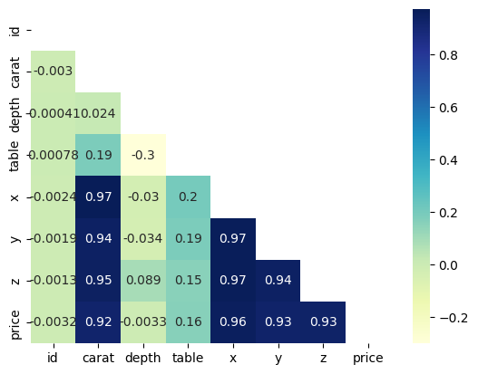
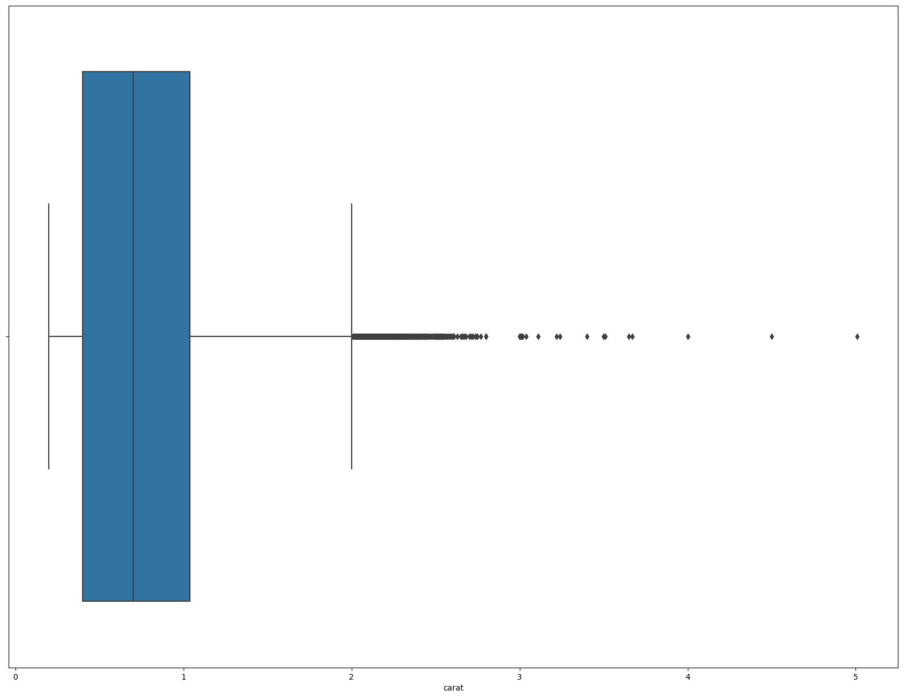
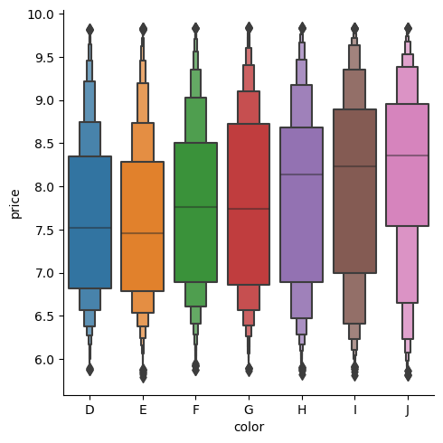
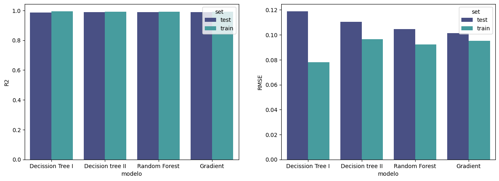

# Diamond price predictor.

## Introduction.
---
The predictive models i made are for a [kaggle competition](https://www.kaggle.com/competitions/diamonds-datamad1022/overview) where the objective is to predict acurately the price of a set of diamonds.

## How?
---

We have a csv with diamonds with many characteristics like it's color, carat, clarity etc. Aswell we have the prices of these diamonds, so we can train our models with this data to try to predict then the test diamonds, which we have all of it's characteristics except it's price.
So that's the objective, acurately predict diamond prices.

## Explanation of Model_2.
---

I got two models that had very good metrics, so i'll explain briefly how they best one work.

[Model_2](https://github.com/Slivered/Project_Machine_learning/blob/main/Model_2_train.ipynb) : The objective for this model was to have as few columns to predict as posible, so i made an exhaustive analysis of every column and droped the ones that were not relevant.
.

As we can see in this graph the numeric columns carat, x, y and z are very related to the predictive variable price, so i decided to drop x,y and z becouse carat englobes all of these three as its the weight of the diamond, so it's obvious that a heavier diamond is larger, x, y and z represent it's millimeters in length.

I droped depth and table aswell becouse they were not very related to the price of the diamond and my objective was to have as few variables as possible to predict the price.

In this first model i did a robust standardization becouse it had many outliers that i didn't want to replace or erase.

After watching this graph i decided to use a ordinal encoding to give different weights to each of the variables in each categoric column.

As we can see in this graph the least overfitted model is the Gradient Booster, and it has the best RMSE of them all. So i decided to use that model.

## Conclusion.
---
 * [Model_2](https://github.com/Slivered/Project_Machine_learning/blob/main/Model_2_train.ipynb) is the best one, the only difference between the model 1 and 2 is that model 2 has a ordinal encoding.
 * Feel free to open my notebook to se the code for how everything was done, i have explanations for each of the decissions i did to get the best model written there.

## Tools.

* [Pandas](https://pandas.pydata.org/docs/) is a fast, powerful, flexible and easy to use open source data analysis and manipulation tool, built on top of the Python programming language.

* [Pickle](https://docs.python.org/3/library/pickle.html) is used to store safely a list outside of your notebook, so if your kernel shuts down you won't lose any data.

* [Matplotlib](https://matplotlib.org/stable/index.html) was used to make the graphs.

* [Scikit-learn](https://scikit-learn.org/stable/index.html) Simple and efficient tools for predictive data analysis

